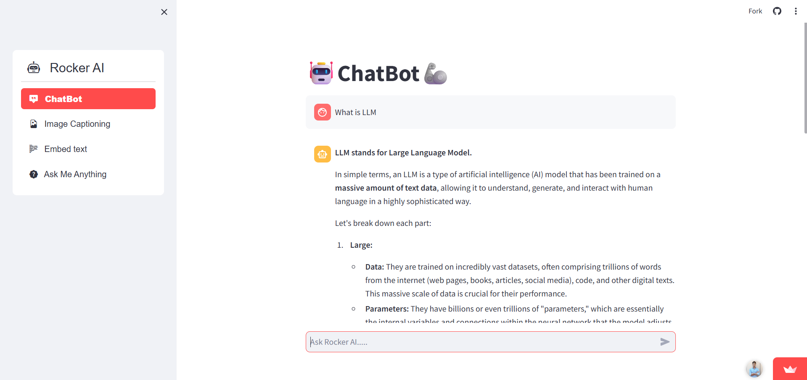
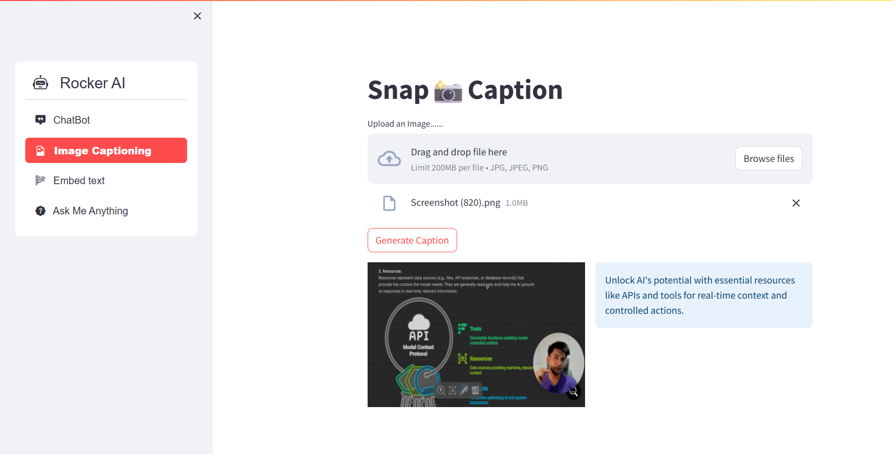
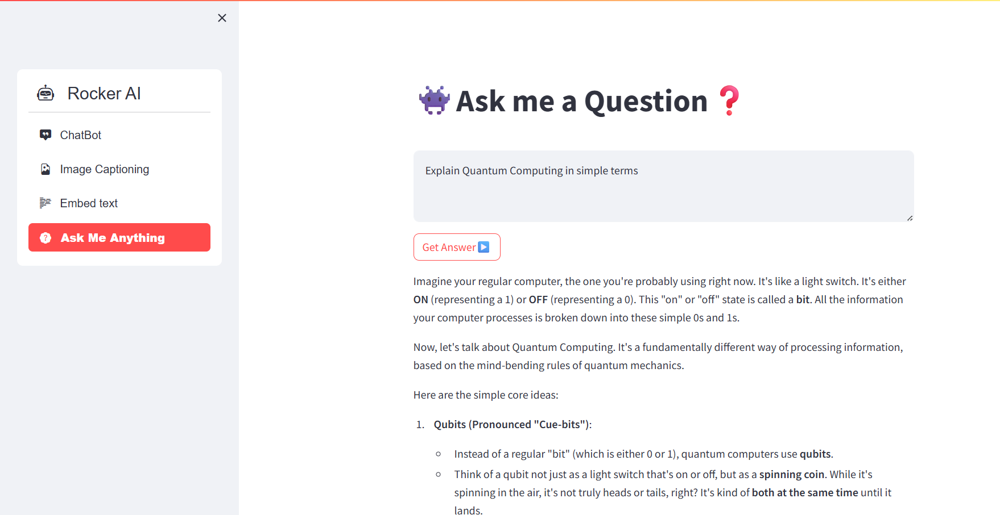

## 🐺 Rocker AI – Your Multi-Talented Chatbot

 **Rocker AI** is an interactive Streamlit-based AI assistant powered by **Google’s Gemini 2.5 family of models**.
It brings together chat, vision, embeddings, and Q\&A — all in one sleek app.

👉 [Try Rocker AI Live](https://rockerai.streamlit.app/)

---

## ✨ Features

### 🤖 ChatBot

* Powered by **Gemini-2.5-Flash** for fast, interactive conversations.
* Engages naturally with context-aware responses.

📸 *Screenshot:*


---

### 🖼️ Snap Captioning

* Upload any image and let **Gemini-2.5-Flash-Lite** describe it.
* Great for visual interpretation and quick insights.

📸 *Screenshot:*


---

### 🔢 Text Embeddings

* Generate **semantic embeddings** using `gemini-embedding-001`.
* Useful for tasks like semantic search, clustering, and retrieval.

📸 *Screenshot:*


---

### ❓ Ask Me Anything

* A lightweight Q\&A mode powered by **Gemini-2.5-Flash**.
* Get simple, clear answers to any query.

📸 *Screenshot:*


---

## 🏗️ Project Structure

```
📂 Rocker-AI
├── .devcontainer/       # Dev container setup
├── README.md            # Project documentation
├── config.json          # API key configuration
├── gemini_utility.py    # Utility functions for models
├── main.py              # Streamlit app UI
└── requirements.txt     # Dependencies
```

---

## ⚙️ How It Works

1. **Frontend (UI):**

   * Built with **Streamlit** (`main.py`)
   * Simple navigation for chatbot, captioning, embeddings, and Q\&A.

2. **Backend (Models):**

   * Defined in `gemini_utility.py`
   * Uses the latest Gemini models:

     * **`gemini-2.5-flash`** → Chatbot & Q\&A
     * **`gemini-2.5-flash-lite`** → Vision (image captioning)
     * **`models/gemini-embedding-001`** → Text embeddings

---

## 🚀 Getting Started

### 1️⃣ Clone the Repo

```bash
git clone https://github.com/yourusername/rocker-ai.git
cd rocker-ai
```

### 2️⃣ Install Dependencies

```bash
pip install -r requirements.txt
```

### 3️⃣ Add API Key

* Create a `config.json` file (already in repo).
* Add your Google Generative AI API key:

```json
{
  "GOOGLE_API_KEY": "your_api_key_here"
}
```

### 4️⃣ Run the App

```bash
streamlit run main.py
```

---

## 🌍 Deployment

Rocker AI is live here:
👉 [https://rockerai.streamlit.app/](https://rockerai.streamlit.app/)

---

## 🤝 Contributing

* Fork the repo
* Create a new branch (`feature-new`)
* Commit changes
* Submit a pull request 🎉

---

## 📌 Tech Stack

* **Frontend:** Streamlit
* **Backend Models:** Google Gemini (via `google-generativeai`)
* **Language:** Python 3.x

---

## 💡 Why Rocker AI?

* Unified app: Chat, Vision, Embeddings, and Q\&A in one place.
* Built on **cutting-edge Gemini models**.
* Open-source, extensible, and easy to deploy.

---

## 🐺 Rock With Rocker AI

Unleash the power of **AI that chats, sees, and understands** – all in one app.

---
👨‍💻 Made with ❤️ by [Virendra Badgotya]
